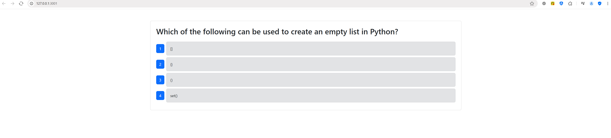
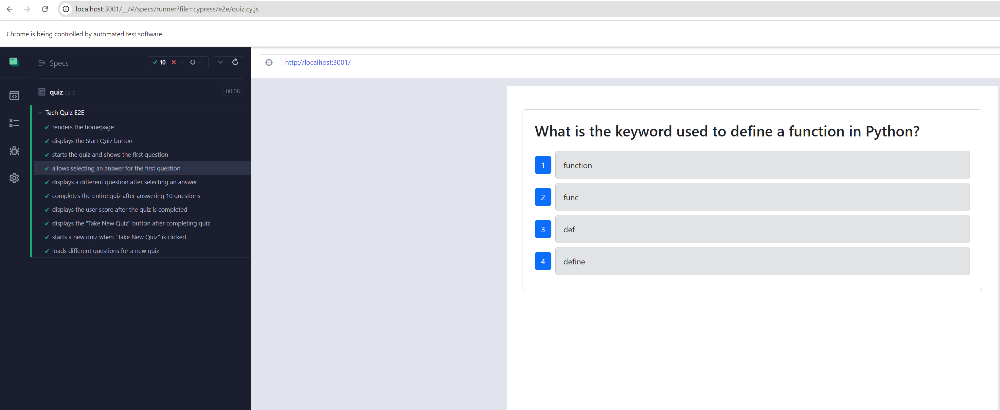
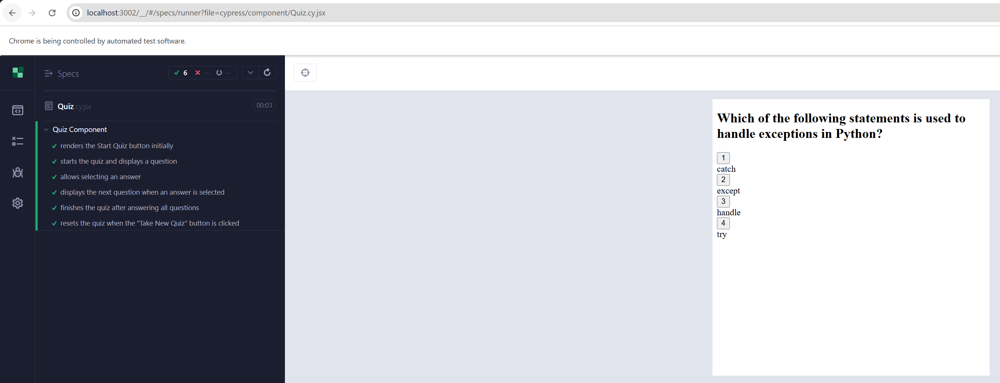

# Kyle's Tech Quiz Test Suite Application

## Description 
📝 
This application is a fully functioning Tech Quiz application that adds Cypress for both component and end-to-end tests. The app was built using the MERN stack with a React front end, MongoDB database, and Node.js/Express.js server and API. It allows users to take a quiz of ten random questions and view their final score.

## Demo Link
📽️- [Demo Link of Application](https://drive.google.com/file/d/1I998hLs0YDMPXRi5pA9PdNAJS1aZL313/view)  

---

## 🎨 **Mock-Up**

---

## Table of Contents 📋 
- [Installation](#installation)
- [Usage](#usage)
- [License](#license)
- [Contributing](#contributing)
- [Tests](#tests)
- [Questions](#questions)

## Installation
💽 
First, Download the required dependencies, React, cypress, and mongoose. Once the dependencies are installed on the package.json, then you will need to run the terminal commands.  
As follows the terminal commands are npm install, npm run build, and lastly npm run start:dev to launch the application. This is for local execution. A demo link is provided above since this application is not deployed on a third party source. 

## Usage
🖱️ 
This application's usage is demonstrated in the demo link as it will not be deployed for viewing. This is because the application is for testing components and end-to-end tests in cypress. 

## License
This project is licensed under the [MIT License](https://opensource.org/licenses/MIT).

## Contributing
✍️ 
Any developer can contribute under the MIT license. 

## Tests
🖥️ 
You may test the application by executing the integrated terminal command, "npm run start:dev" to launch the application. If you want to run tests in cypress, execute the terminal command, "npm run test". 

## Questions
❓ 
For additional questions, reach out to me via:
- GitHub: [KyBrMar12](https://github.com/KyBrMar12)
- Email: KyBrMar@gmail.com
